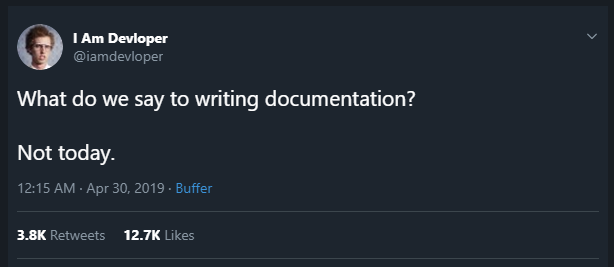

# Writing READMEs README

 Here, you can find some supplemental resources for writing good READMEs.

### Concepts
>* What is documentation?
>* Why do we need documentation?
>* Who is documentation for?
>* [First question](#question-1)
>* [Sample READMEs](#Sample-READMEs)
>* [What to include in documentation?](#what-to-include-in-documentation)
>* [Resources](#Resources)
>* [Second question](#Question-2)
>* Demo
>* Workshop
>* [Documentation day?](#Documentation-day)
>* Bad Examples


## Resources

* [Choose A License](http://choosealicense.com/) - Helpful website for picking out a license for your project.
* [Github flavored markdown reference](https://help.github.com/categories/writing-on-github/) - Github's own documentation about documentation.
* [Online Markdown Editor](https://rentry.co//) - Online write and share markdown content.
  
## Sample READMEs
Consider four README's for four different projects below:

As you examine each of the README's, take note of the following:

>* What information is being communicated?
>* How is this information structured?
>* Do you notice any patterns?

* [Aleph](https://github.com/alephdata/aleph) - Aleph is a tool for indexing large amounts of both documents (PDF, Word, HTML) and structured (CSV, XLS, SQL) data for easy browsing and search.. The documentation is thorough and complete, so anybody can use it!
* [factory_bot](https://github.com/thoughtbot/factory_bot) - An open source project maintained by thoughtbot. Great example of simple instructions to get you set up, which then links to external documentation.
* [can.viewify](https://github.com/zkat/can.viewify) - Awesome example of someone documenting her personal projects concisely.
* [ecommerce](https://github.com/kkosiba/ecommerce-backend) - This README is for one ecommerce backend app.


## What to include in documentation? 
* What are the exact steps that need to be taken to get this code base up and running?
* What should users already have installed or configured?
* What might they have a hard time understanding right away?
**The important part is that you communicate clearly and concisely any information that is essential for the user!**


## How to Contribute

Find any typos? Have another resource you think should be included? Contributions are welcome!

First, fork this repository.


Next, clone this repository to your desktop to make changes.

```sh
$ git clone {YOUR_REPOSITORY_CLONE_URL}
$ cd writing-readmes
```

Once you've pushed changes to your local repository, you can issue a pull request by clicking on the green pull request icon.


Instead of cloning the repository to your desktop, you can also go to `README.md` in your fork on GitHub.com, hit the Edit button (the button with the pencil) to edit the file in your browser, then hit the `Propose file change` button, and finally make a pull request. 


## To Do
 Add more questions


## Questions

##### Question 1
 Who might be a potential end-user of documentation? Select all that apply:
* [ ]  You
* [ ]  Your coworkers
* [ ]  Your contributors
* [ ]  Your users

##### Question 2
 As a code base grows, which sections might you add to your README?

* [ ] Known bugs
* [ ] Frequently asked questions
* [ ] How popular  your project has become
* [ ] Table of contents
* [ ] Pictures of your cat
  


## Documentation day

"On the last Friday every month?" -- Rysiek




## License

The contents of this repository are covered under the [MIT License](LICENSE).
